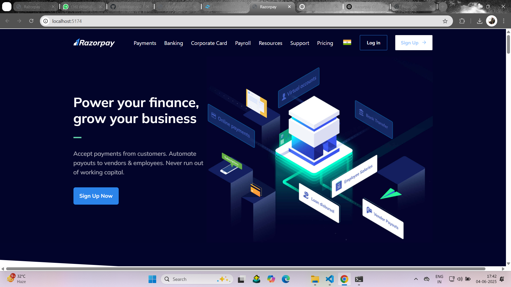
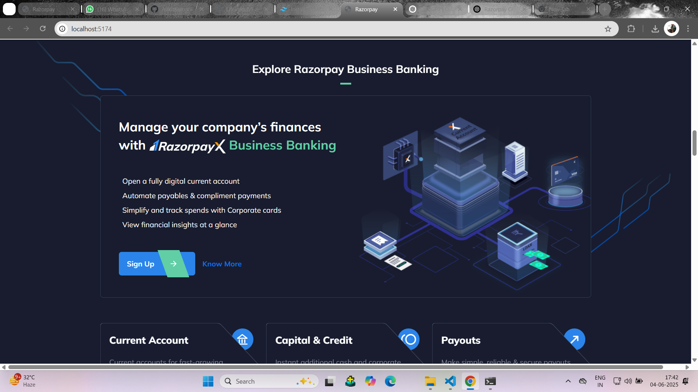
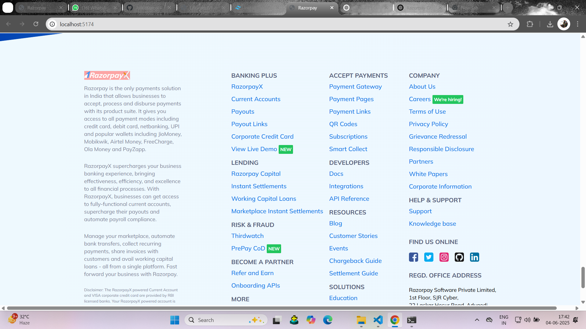

# 🌐 Razorpay Homepage Clone

A clean and responsive Razorpay homepage clone built using **Tailwind CSS**. This project replicates the visual design of the Razorpay homepage, demonstrating how utility-first CSS can be used to quickly create beautiful and scalable UIs.

Hi there! 👋  
Welcome to my **Razorpay Clone** project — a pixel-perfect recreation of the [Razorpay](https://razorpay.com) homepage using the power of **Tailwind CSS**.

This project was built to sharpen my frontend skills, dive deeper into responsive design, and explore how a real-world product landing page can be recreated using utility-first CSS. It's also a great way to demonstrate how fast and efficient Tailwind can be for building modern UIs.

---

## ✨ Preview

Here's a sneak peek of the final result:

> 💡 *Make sure to replace the screenshot with an actual image from your project. You can rename the file or change the path as needed.*

---

## 🧠 What I Learned

While working on this project, I focused on:

- Structuring clean and semantic HTML
- Leveraging Tailwind’s utility classes to speed up development
- Implementing a fully responsive layout
- Handling spacing, typography, and color systems the Tailwind way
- Paying attention to small details like hover effects, transitions, and layout alignment

---

## 🔧 Tech Stack

This project is intentionally kept simple to focus on core skills:

| Tool           | Description                            |
|----------------|----------------------------------------|
| 💻 HTML5        | Markup structure                       |
| 🎨 Tailwind CSS | Utility-first CSS framework for styling |
| 🧪 PostCSS      | For processing Tailwind styles          |
| 📱 Responsive Design | Mobile-first approach               |

---

